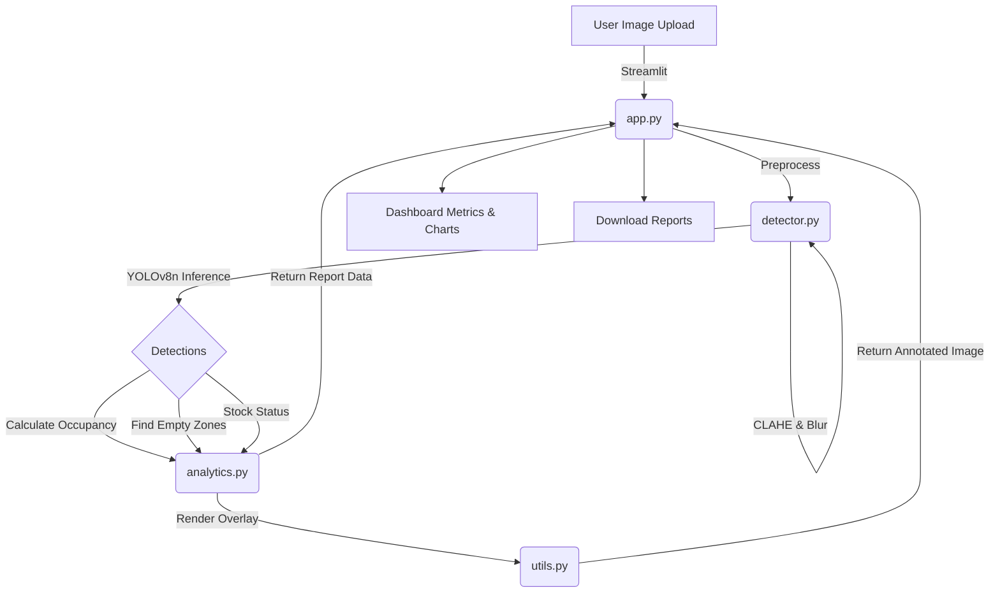

# SmartShelf AI — Retail Inventory Monitor

A real-time retail shelf monitoring and inventory analytics system using YOLOv8 and OpenCV, featuring a comprehensive Streamlit dashboard.


## Features
- **Real-Time Detection:** Utilizes the YOLOv8 nano model for rapid inference to identify products on retail shelves.
- **Image Enhancement:** Preprocesses images using Gaussian blur and CLAHE for optimized object detection under varying lighting conditions.
- **Shelf Analytics:** Calculates shelf occupancy percentage and counts total products.
- **Stock Status Alerts:** Automatically determines stock status ("Well Stocked", "Low Stock", "Critical").
- **Empty Zone Detection:** Overlays a 3x3 grid to pinpoint exactly where restocking is required.
- **Interactive Dashboard:** Streamlit UI with adjustable thresholds, Plotly visualizations, and batch processing capabilities.
- **Exportable Reports:** Download annotated images (PNG) and detailed detection reports (CSV).

## Architecture



## Setup Instructions

1. Clone or download the repository.
2. Ensure you have Python 3.10+ installed.
3. Install the required dependencies:
   ```bash
   pip install -r requirements.txt
   ```
4. Run the Streamlit application:
   ```bash
   streamlit run app.py
   ```

## How to Use

1. Launch the application, which will automatically download the `yolov8n.pt` pretrained weights.
2. Open your web browser to `http://localhost:8501`.
3. Select an **Upload Mode** from the sidebar (Single Image or Batch Mode).
4. Adjust the **Confidence Threshold** and **Low Stock Alert Threshold** to fine-tune the analytics.
5. Upload one or more shelf images.
6. Review the original and annotated images side-by-side.
7. Analyze the dashboard metrics, product distribution bar chart, and shelf occupancy gauge chart.
8. Download the annotated image or CSV report for your records.

## Sample Metrics

*Placeholder results from a typical batch run:*
> **Detected 47 products across 5 shelf images | Avg occupancy: 68% | 2 low-stock alerts triggered**
